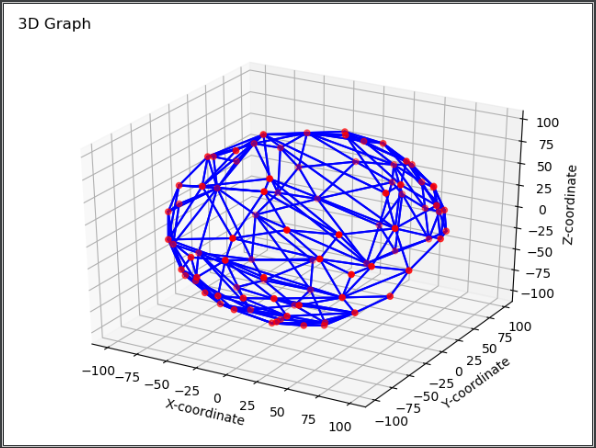
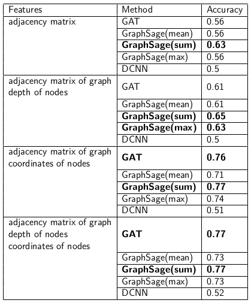

# Characterization of cortical folding patterns by machine learning on graphs
Yaroslav Mavliutov 

Intership 2019

### Abstract
Deep learning (DL) has revolutionized many tasks in recent years, ranging from video processing to machine translation to audio recognition. Data of these problems are usually
presented in Euclidean space.
This work describes alternative DL models that are adapted to data are generated from non-
Euclidean domains. These data are represented as graphs that are derived from a topography,
where the deepest parts of a cortical sulci are nodes of the graph.
In this project, we implemented GraphSage, DCNN, GAT to solve the problem of binary
node classification. In a number of experiments on real dataset we demonstrate that selected
methods outperform proposed trivial model. All models have been implemented in Python.

This repository provides an implementation of DL models for binary classification, as described in the paper:

> Characterization of cortical folding patterns by machine learning on graphs.
> Yaroslav Mavliutov, 2019.
> [[Paper]](https://github.com/yaroslavmavliutov/Characterization-of-cortical-folding-patterns-by-machine-learning-on-graphs/blob/master/paper.pdf)


### Installation:
```
-conda create -n pytorch_graph python=3.7.0

-conda activate pytorch_graph

-install pythorch (copy-past from https://pytorch.org/):
conda install pytorch torchvision cudatoolkit=9.2 -c pytorch

-conda install networkx

-conda install tqdm

-conda install scikit-learn

-conda install matplotlib

-install pytorch geometric (copy-past from https://github.com/rusty1s/pytorch_geometric) :
$ pip install --verbose --no-cache-dir torch-scatter
$ pip install --verbose --no-cache-dir torch-sparse
$ pip install --verbose --no-cache-dir torch-cluster
$ pip install torch-geometric
```
### Datasets
134 right-handed healthy subjects were selected from the Open Access Series of Imaging
Studies (OASIS) database. From this dataset, we defined
two groups of 67 and 67 young adult healthy subjects (aged 18–34 years) matched in age,
gender, cortical surface area and intracranial volume. For each subject, the sulcal pits and
corresponding graphs representation were extracted as presented above.
More precisely, the graph of each subject is characterized by a matrix of adjacency, a vector
of depth of nodes and a vector of coordinates of nodes. 

3D visualization of one of these graphs.
<p align="center">
  
</p>
<p align="justify">

### Results

A method based on diffusion-convolutional representation is most likely limited due to their
invariance with respect only to node index without his position. This method implements the
latent representation from diffusion processes that begin at each node, but we can not use
spatial dependencies between individual nodes.
A method based on on embedding nodes, as GraphSage, and a method based on self-
attention strategy, as GAT, showed the best accuracy. We can explain this because these
methods study characteristics of neighboring nodes. GAT can overcome DCNN’s limitation by
learning the structural information of each node’s neighborhood, on the other hand are limited
by performing masked attention only for adjacent nodes. GraphSage studies the topological
structure of each node’s neighborhood as well as the distribution of node features in the
neighborhood.

Table with results of Nodes classification
<p align="center">
  
</p>
<p align="justify">


# Tutorial:

## create_full_hemisphere_pitsgraphs.py

- Create the graphs

- Save it using pickle in the folder pitgraphs_path
Then corresponding data were uploaded on git in newdata folder

## utils.py

- Concantenate graph data from all subjects into a specifically created GCDataset object

## trivial_model.py

- Computes the trivial model (independent from deep learning package)

- Various plot and basic data description

## train.py

- To train a DL model

## models.py

- Instantiate each type of model as a specific model class

## layers.py

- Specific settings for GraphSAGE model
